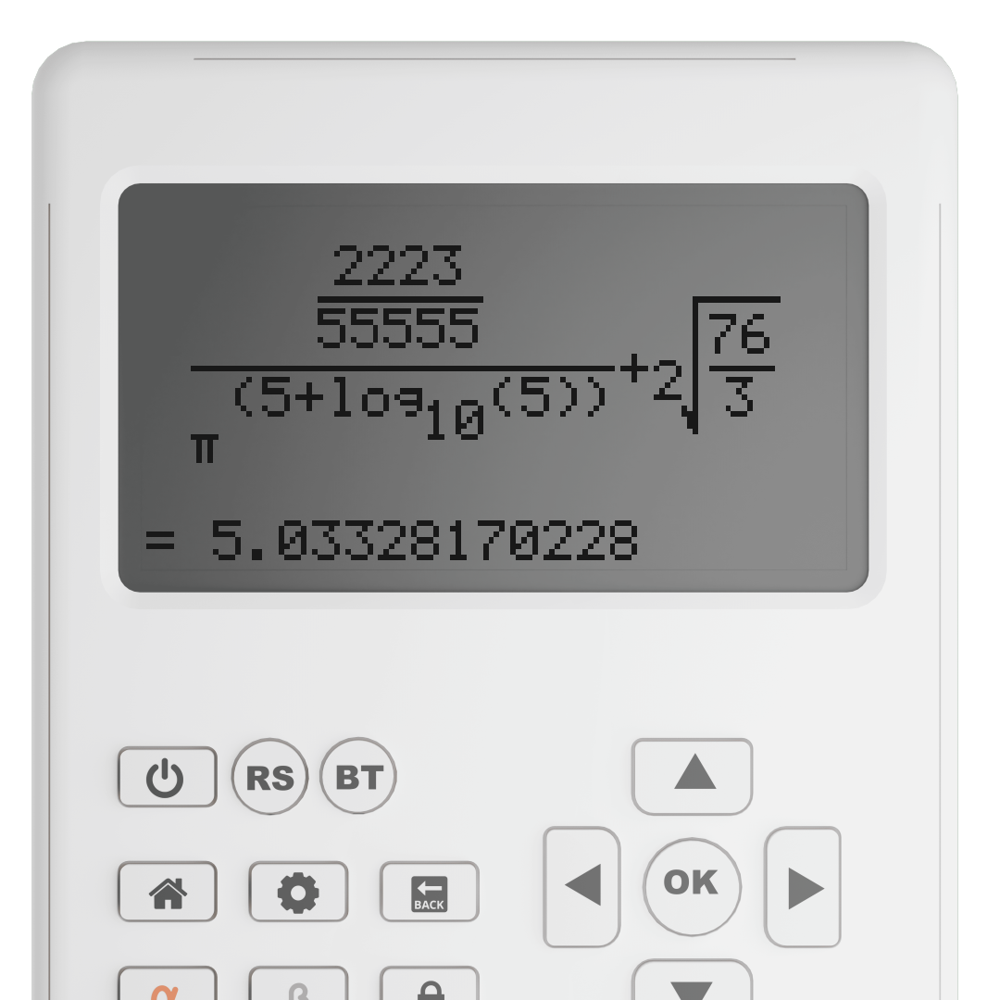
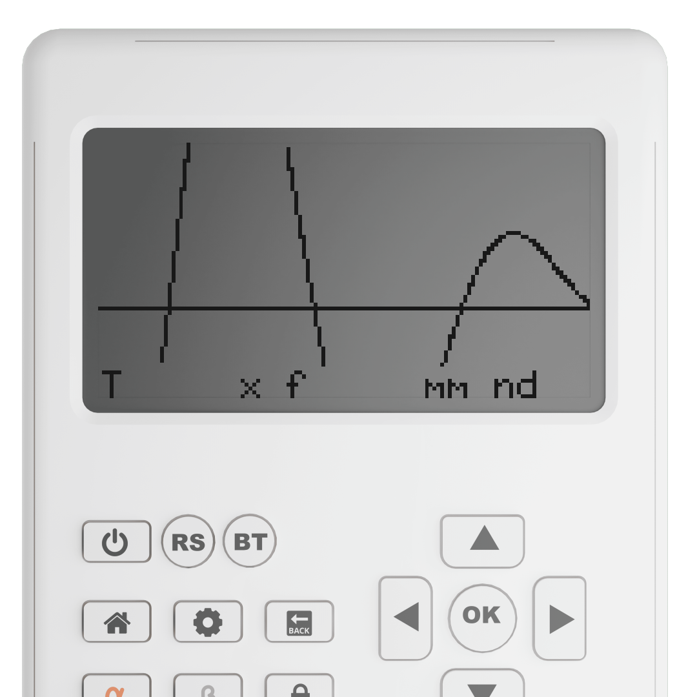
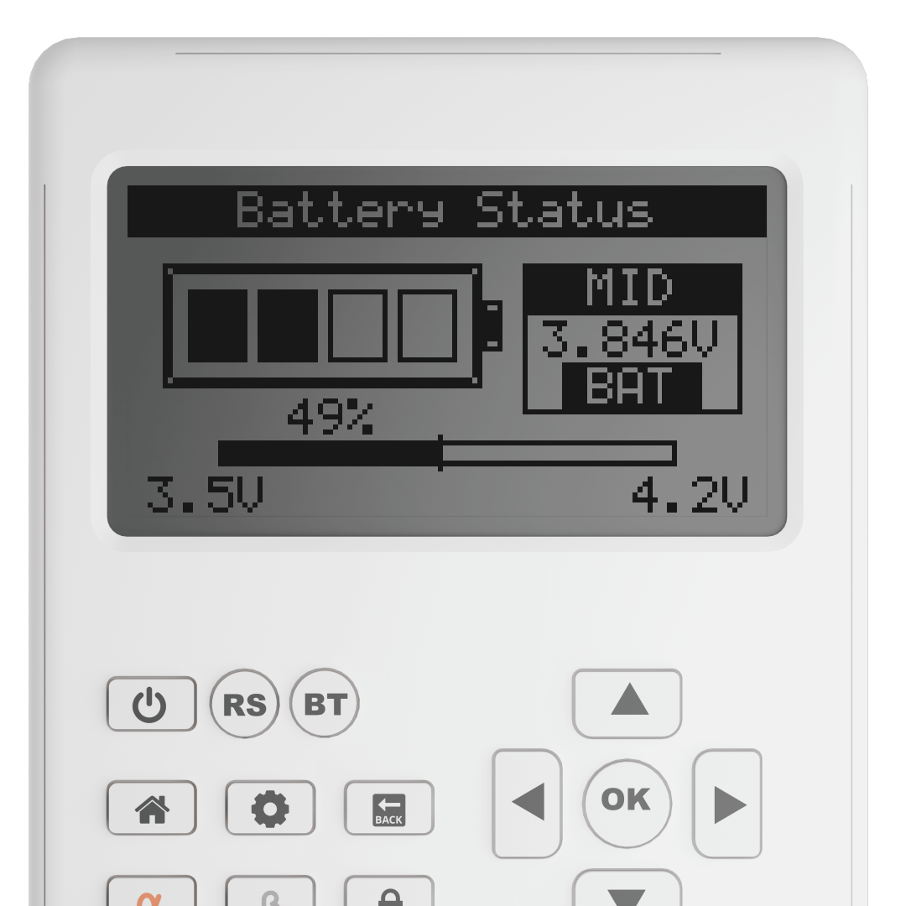
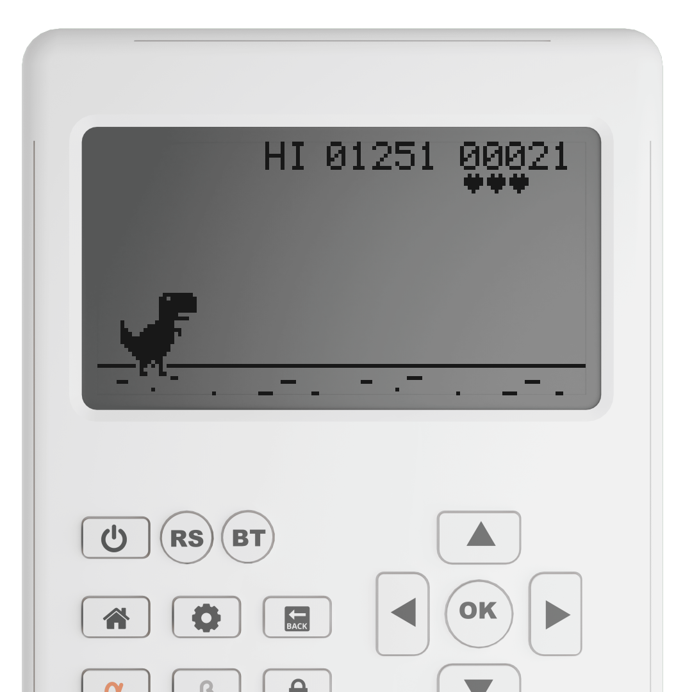
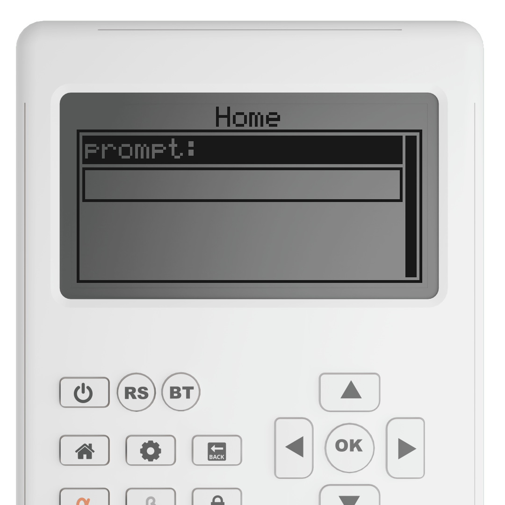

# calsci_latest_itr_simulator

Thin desktop simulator for CalSci.

<table>
  <tr>
    <td align="center">
      <br>
      <sub><b>Calculate</b></sub>
    </td>
    <td align="center">
      <br>
      <sub><b>Graph</b></sub>
    </td>
    <td align="center">
      <br>
      <sub><b>Battery Status</b></sub>
    </td>
  </tr>
  <tr>
    <td align="center">
      <br>
      <sub><b>Dino</b></sub>
    </td>
    <td align="center">
      <br>
      <sub><b>ChatGPT</b></sub>
    </td>
    <td></td>
  </tr>
</table>

## Run

### Linux / macOS

```bash
cd calsci_simulator
python3 -m venv .venv
source .venv/bin/activate
python -m pip install -r requirements.txt
python main.py
```

### Windows PowerShell

```powershell
cd calsci_simulator
py -m venv .venv
.\.venv\Scripts\Activate.ps1
python -m pip install -r requirements.txt
python main.py
```

### Windows Command Prompt

```cmd
cd calsci_simulator
py -m venv .venv
.venv\Scripts\activate.bat
python -m pip install -r requirements.txt
python main.py
```

Note: plain `git clone --recurse-submodules` checks out the simulator's pinned submodule commit. Use the `--remote-submodules` flow above if you want the newest `calsci_latest_itr/main` tip on clone.

If PowerShell blocks script activation on Windows, run the Command Prompt variant instead.

## Controls

- Click calculator keys in the window.
- Optional keyboard shortcuts:
  - `F5` -> reload the simulator
  - `Enter` -> `ok`
  - `Backspace` -> `back`
  - `Delete` -> `nav_b`
  - Arrow keys -> navigation keys
  - `Ctrl+Left` -> `back`
  - `Ctrl+A` -> `alpha`
  - `Ctrl+B` -> `beta`
  - `Ctrl+H` -> `home`
  - `Ctrl+L` -> `lock`
  - `0-9`, `.,()+-/*` -> matching calculator keys
  - `F1`, `F2`, `F3`, `F4`, `F6` -> matching calculator keys
  - `S` -> save a display screenshot
  - `V` -> start/stop display video recording
  - `Esc` -> `home`
  - `Ctrl+Q` -> quit

## Notes

- Paths like `/db/...` or `/apps/...` are remapped to `./calsci_latest_itr/db/...` and `./calsci_latest_itr/apps/...` by default.
- Some hardware/network-specific apps run in simulated/no-op mode where needed.
- Screenshots are saved in `../simulator_screen_shots`, and display recordings are saved in `../simulator_videos`.
- Display recording shells out to `ffmpeg`, so it needs to be available on `PATH`.
